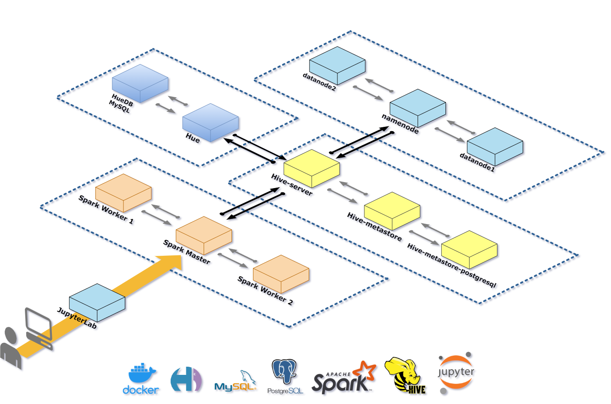
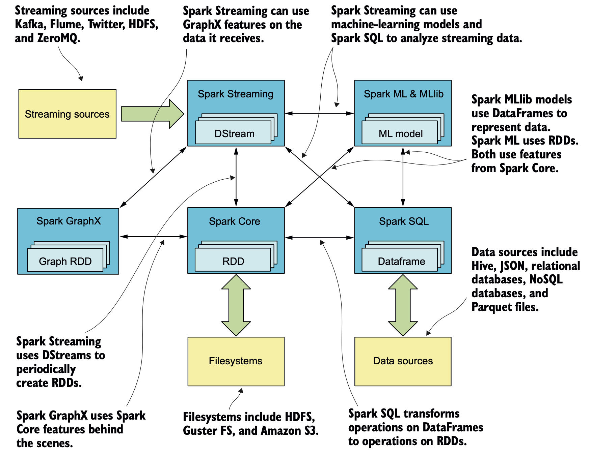
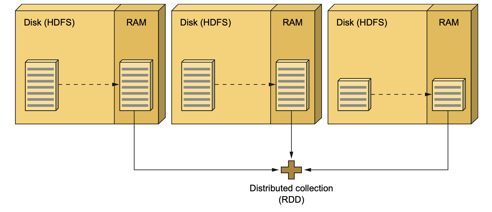
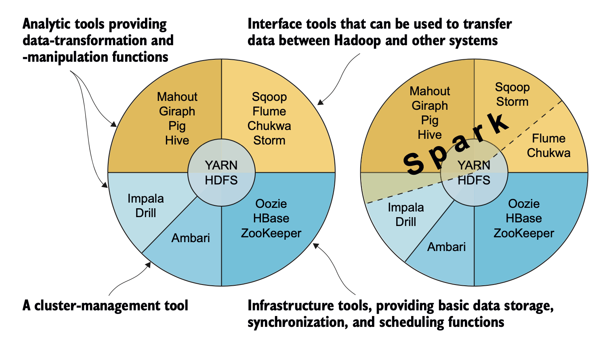
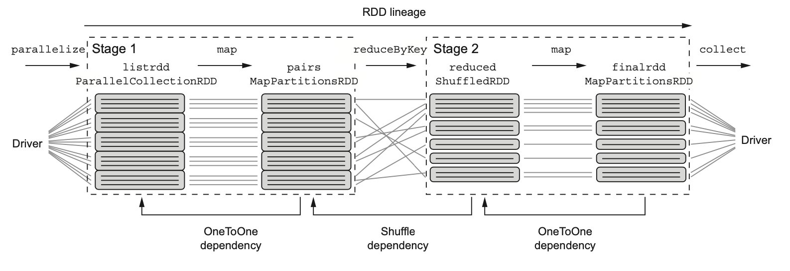
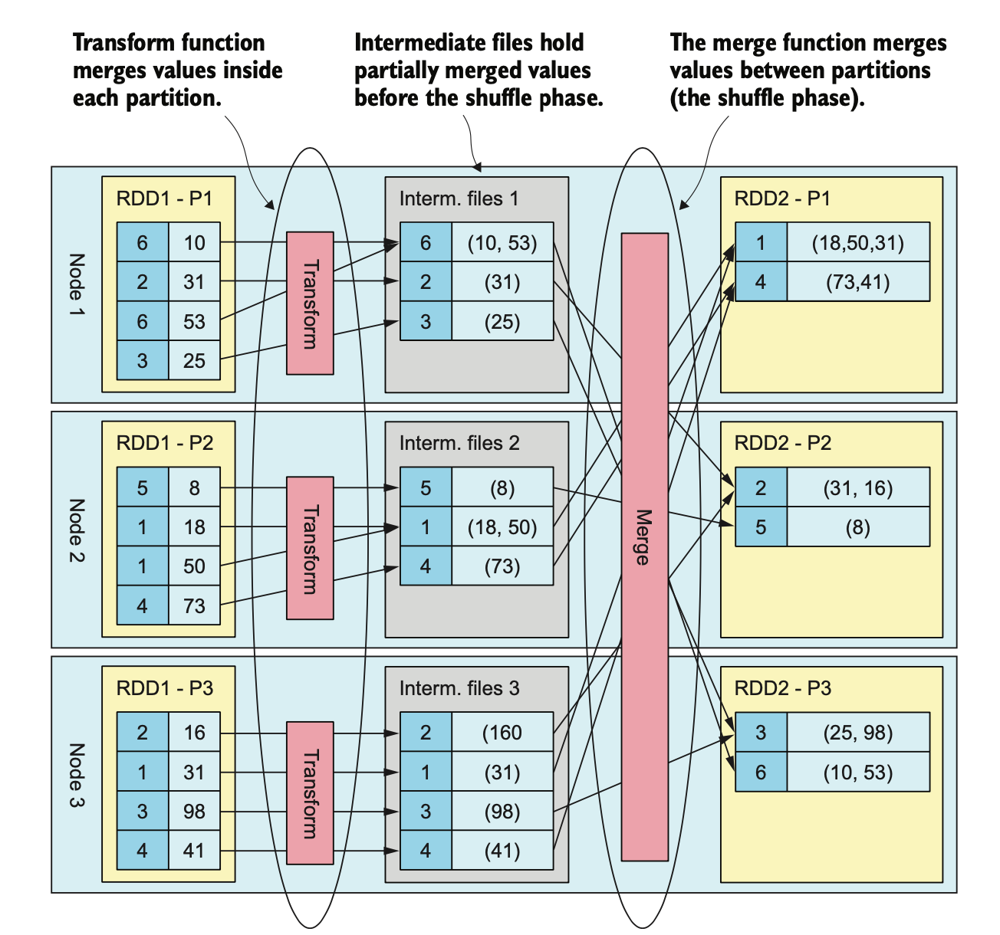
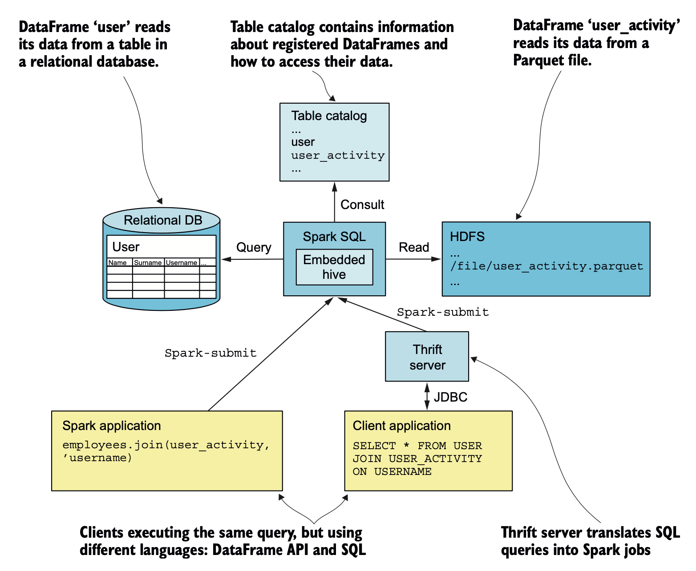
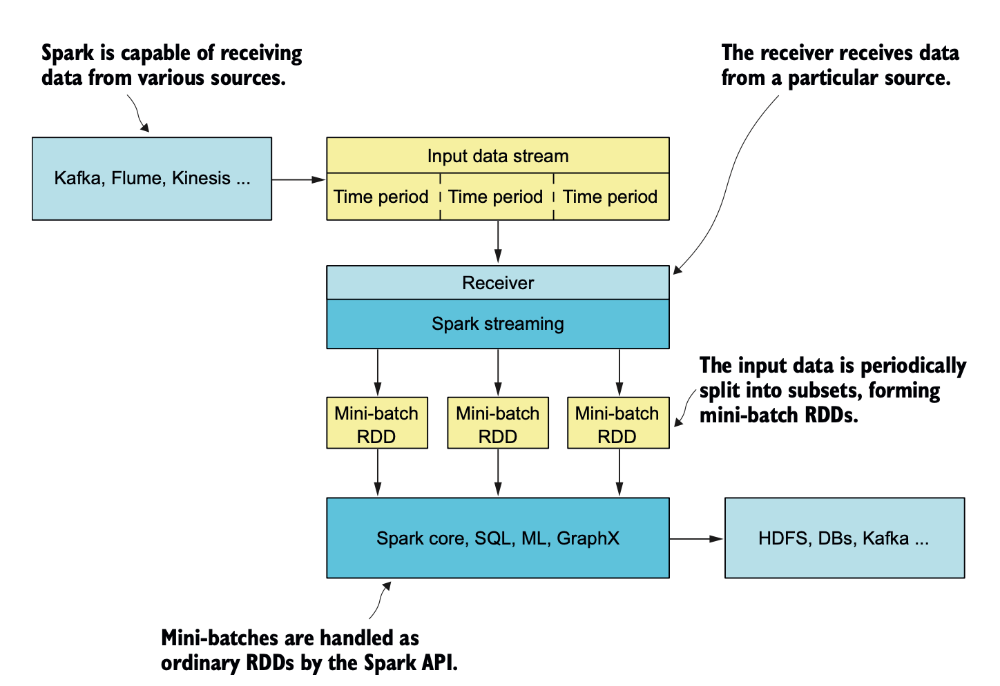
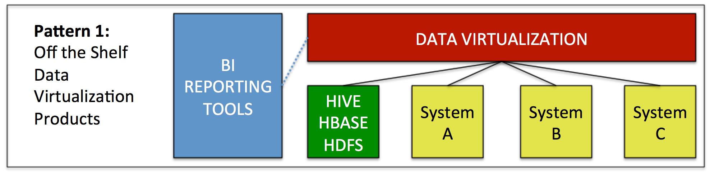
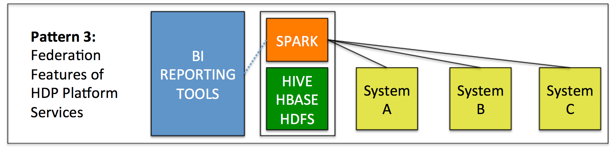

# Spark

## Overview

<p float="left">
   
</p>

### Components

`RDD` (Resilient Distributed Dataset) is the main element of the `Spark API`:
* RDD allows you to work with a `distributed` collection the same way you would work with any `local`, non-distributed one;
* RDD provides an elaborate API, which allows you to work with a collection in a `functional` style;
* RDD is `resilient` because it is capable of rebuilding datasets in case of `node failures`;
* RDD is `immutable` (read-only), data transformation always yields a new RDD instance.

<p float="left">
   
</p>

Given the task of analyzing how many errors of type OutOfMemoryError have happened during the last two weeks.

1. Start the `Spark shell` and establish a connection to the `Spark cluster`:
```bash
spark-shell
```

2. Load the log file from HDFS:
```scala
val lines = sc.textFile("hdfs://path/to/the/file")
```

3. Filter the collection and `cache` it, which tells Spark to leave that RDD in memory across jobs:
```scala
val oomLines = lines.filter(l => l.contains("OutOfMemoryError")).cache()
```

4. Count the collection:
```scala
val result = oomLines.count()
```

<p float="left">
   
</p>

Spark can run on top of the following cluster:
* Hadoop's YARN;
* Spark standalone cluster;
* Apache `Mesos`, which is an advanced distributed system's kernel bringing distributed resource abstractions that can `scale to tens of thousands of nodes` with full fault tolerance.

### Ecosystem

* `Spark Streaming` can replace `Apache Storm`;
* `Spark MLlib` can replace `Apache Mahout`;
* `Spark GraphX` can replace `Apache Giraph`;
* `Spark Core` and `Spark SQL` can replace `Apache Pig`, `Apache Sqoop` and `Apache Hive`;
* `Spark` is for `OLAP`, whereas `HBase` is a ditributed and scalable database for `OLTP`.

<p float="left">
   
</p>


## Installation

### Spark standalone cluster

1. Download the Spark binary from [this link](https://spark.apache.org/downloads.html):
```bash
tar -xvzf spark-3.2.1-bin-hadoop3.2.tgz
sudo mv spark-3.2.1-bin-hadoop3.2 /usr/local/spark
```

2. Update `.bashrc`:
```bash
export SPARK_HOME=/usr/local/spark
export PATH=$PATH:$SPARK_HOME/bin
```

3. Start the `Spark shell`:
```bash
spark-shell
```

## Word Count

1. Prepare the local file `docs` as below:
```bash
Mary had a little lamb
its fleece was white as snow
and everywhere that Mary went
the lamb was sure to go
```

2. Execute the following statements in the Spark shell:
```scala
scala> val docs = sc.textFile("hdfs://localhost:9000/docs")
scala> val docs = sc.textFile("file:///home/shu/docs")
scala> val docs = sc.textFile("docs")
docs: org.apache.spark.rdd.RDD[String] = docs MapPartitionsRDD[1] at textFile

scala> val counts = docs.flatMap(line => line.split(" ")).map(word => (word,1)).reduceByKey(_+_)
counts: org.apache.spark.rdd.RDD[(String, Int)] = ShuffledRDD[4] at reduceByKey

counts.collect()
```

3. The result is as below:
```
res0: Array[(String, Int)] = Array((went,1), (its,1), (fleece,1), (as,1), (everywhere,1), (go,1), (lamb,2), (little,1), (white,1), (was,2), (had,1), (a,1), (that,1), (to,1), (sure,1), (Mary,2), (and,1), (snow,1), (the,1))
```

## Pyspark

1. Pyspark API can be used to connect to the Spark cluster:
```bash
python logs.py "file:///home/shu/Documents/workspace/Spark/data/2015-03-01-0.json" "./data/employees.txt" "file:///home/shu/Documents/workspace/Spark/output" "json"
```

2. `Spark submit` can be used to submit the Python code snippet to the Spark cluster:
```bash
spark-submit --master local[*] logs.py "file:///home/shu/Documents/workspace/Spark/data/2015-03-01-0.json" "./data/employees.txt" "file:///home/shu/Documents/workspace/Spark/output" "json"
```

3. The result can be viewed as below:
```bash
cat output/part-*.json

{"login":"KenanSulayman","count":72}
{"login":"manuelrp07","count":45}
{"login":"Somasis","count":26}
{"login":"direwolf-github","count":24}
{"login":"EmanueleMinotto","count":22}
```

## Partition + Shuffle

<p float="left">
   
</p>

* During `checkpointing`, the entire RDD is persisted to disk: `data` and `RDD dependencies`/`RDD lineage`;
* `RDD dependencies` make RDDs resilient;
* `checkpoint` must be called before any `jobs` are executed on the RDD, and the RDD has to be materialized afterward;
* The results of Stage 1 are saved on disk as intermediate files on executor machines. During Stage 2, each partition receives data from these intermediate files belonging to it, and the execution is continued;
* For each `stage` and each partition, `tasks` are created and sent to the executors.

```scala
scala> val list = List.fill(500)(scala.util.Random.nextInt(10))
list: List[Int] = List(1, 0, 0, 3, 8, 5, 7, 1, 3, 9, 0, 0, 4, 5, 3, 8, 6, 5, 4, 4, 5, 1, 2, 0, 1, 7, 3, 5, 4, 4, 5, 0, 3, 0, 0, 4, 4, 6, 8, 5, 2, 9, 9, 6, 0, 6, 2, 6, 0, 2, 5, 9, 7, 4, 8, 3, 2, 8, 2, 8, 8, 8, 3, 2, 6, 5, 5, 6, 7, 2, 6, 9, 8, 4, 4, 3, 7, 9, 2, 9, 9, 3, 3, 9, 9, 3, 9, 3, 4, 9, 9, 5, 4, 4, 7, 2, 7, 6, 5, 2, 8, 5, 6, 7, 9, 0, 2, 3, 0, 1, 7, 4, 6, 9, 6, 2, 8, 2, 1, 5, 3, 1, 2, 4, 8, 3, 9, 8, 2, 3, 4, 8, 2, 2, 9, 4, 2, 4, 2, 9, 9, 1, 0, 5, 3, 7, 3, 9, 6, 2, 4, 3, 5, 0, 0, 3, 8, 2, 2, 6, 6, 4, 3, 1, 2, 8, 3, 0, 1, 7, 2, 4, 5, 1, 6, 2, 5, 2, 9, 9, 0, 0, 9, 7, 1, 0, 8, 4, 9, 1, 6, 3, 3, 5, 7, 8, 1, 9, 2, 3, 9, 1, 5, 1, 2, 8, 7, 8, 2, 2, 0, 0, 3, 7, 9, 9, 7, 3, 0, 5, 5, 1, 3, 9, 0, 0, 2, 5, 7, 1, 7, 0, 8, 0, 7, 3, 0, 8, 8, 1, 5, 0, 9, 9, 0, 6, 6, 4, 4, 6...

scala> val listrdd = sc.parallelize(list, 5)
listrdd: org.apache.spark.rdd.RDD[Int] = ParallelCollectionRDD[182] at parallelize at <console>:26

scala> listrdd.partitions.size
res107: Int = 5

scala> val pairs = listrdd.map(x => (x, x*x))
pairs: org.apache.spark.rdd.RDD[(Int, Int)] = MapPartitionsRDD[184] at map at <console>:25

scala> val reduced = pairs.reduceByKey((v1, v2) => v1+v2)
reduced: org.apache.spark.rdd.RDD[(Int, Int)] = ShuffledRDD[185] at reduceByKey at <console>:25

scala> reduced.collect
res111: Array[(Int, Int)] = Array((0,0), (5,1300), (1,40), (6,1440), (7,2401), (2,260), (3,540), (8,3008), (4,768), (9,3969))

scala> val finalrdd = reduced.mapPartitions(iter => iter.map({case(k, v) => "k="+k+" and v="+v}))
scala> val finalrdd = reduced.map({case(k, v) => "k="+k+" and v="+v})
scala> finalrdd.collect
res123: Array[String] = Array(k=0 and v=0, k=5 and v=1300, k=1 and v=40, k=6 and v=1440, k=7 and v=2401, k=2 and v=260, k=3 and v=540, k=8 and v=3008, k=4 and v=768, k=9 and v=3969)

scala> finalrdd.toDebugString
res118: String =
(5) MapPartitionsRDD[186] at mapPartitions at <console>:25 []
 |  ShuffledRDD[185] at reduceByKey at <console>:25 []
 +-(5) MapPartitionsRDD[184] at map at <console>:25 []
    |  ParallelCollectionRDD[182] at parallelize at <console>:26 []
```

<p float="left">
   
</p>

* The transform function, passed to `aggregateByKey`, merges values in partitions;
* The merge function merges values between partitions during the shuffle phase.

```scala
scala> val aggregated = pairs.aggregateByKey(0)((vp1, vp2) => vp1+vp2, (v1, v2)=>v1+v2)
aggregated: org.apache.spark.rdd.RDD[(Int, Int)] = ShuffledRDD[195] at aggregateByKey at <console>:25

scala> aggregated.collect
res131: Array[(Int, Int)] = Array((0,0), (5,1300), (1,40), (6,1440), (7,2401), (2,260), (3,540), (8,3008), (4,768), (9,3969))

scala> aggregated.toDebugString
res1: String =
(5) ShuffledRDD[2] at aggregateByKey at <console>:25 []
 +-(5) MapPartitionsRDD[1] at map at <console>:25 []
    |  ParallelCollectionRDD[0] at parallelize at <console>:26 []
```

## Dataframe

<p float="left">
   
</p>

* A permanent `table catalog` (surviving Spark context restarts) is available only when Spark is built with `Hive` support;
* `HiveQL` is capable of running its jobs not only as `MapReduce` jobs, but also as `Spark` jobs;
* It is often necessary to first load data into an `RDD` and then use it to create a `DataFrame`.

```
$ pyspark

>>> data = [["test_data_1", 1], ["test_data_2", 2]]
>>> df = spark.createDataFrame(data)
>>> df.printSchema()
root
 |-- _1: string (nullable = true)
 |-- _2: long (nullable = true)

>>> columns = ["name", "id"]
>>> import pandas as pd
>>> pandas_df = pd.DataFrame(data, columns=columns)
>>> df = spark.createDataFrame(pandas_df)
>>> df.printSchema()
root
 |-- name: string (nullable = true)
 |-- id: long (nullable = true)
 
 >>> from pyspark.sql.types import StructType, StructField, StringType, IntegerType
 >>> schema = StructType([StructField("name", StringType(), True), StructField("id", IntegerType(), False)])
 >>> df = spark.createDataFrame(data, schema) # Another option: df = data.toDF(schema)
 >>> df.printSchema()
 root
 |-- name: string (nullable = true)
 |-- id: integer (nullable = false)
 
 >>> df.show()
+-----------+---+
|       name| id|
+-----------+---+
|test_data_1|  1|
|test_data_2|  2|
+-----------+---+

>>> df.createOrReplaceTempView("df_temp_view") # It is a temporary table in the session memory
>>> spark.catalog.listTables()
[Table(name='df_temp_view', database=None, description=None, tableType='TEMPORARY', isTemporary=True)]

>>> df.write.saveAsTable("df_table") # It will be persisted in ./spark-warehouse/df_table in the default format parquet
>>> spark.catalog.listTables()
[Table(name='df_table', database='default', description=None, tableType='MANAGED', isTemporary=False), 
 Table(name='df_temp_view', database=None, description=None, tableType='TEMPORARY', isTemporary=True)]
 
>>> spark.sql("select * from df_temp_view").show()
>>> spark.table("df_temp_view").show()
>>> spark.sql("select * from df_table").show()
>>> spark.table("df_table").show()
+-----------+---+
|       name| id|
+-----------+---+
|test_data_1|  1|
|test_data_2|  2|
+-----------+---+
```

## Streaming

<p float="left">
   
</p>

* a `DStream` is represented as a sequence of RDDs;

### File streams

```
$ pyspark

>>> from pyspark.streaming import StreamingContext
>>> ssc = StreamingContext(sc, 5) # 5 seconds
>>> fs = ssc.textFileStream("input") # Listen on new files in ./input folder

>>> results = fs.flatMap(lambda x: x.split(" ")).map(lambda x: (x, 1)).window(60).reduceByKey(lambda x, y: x + y).repartition(1).glom().map(lambda arr: ("COUNT", list(arr)))
>>> results.saveAsTextFiles("output") # Save the results in ./output folder

>>> ssc.start()
>>> ssc.stop(False) # False means not to terminate sc while stopping ssc
```

To add random words to text files in `input` folder:
```bash
$ echo "Mary had a little lamb" > input/file1.txt
$ echo "its fleece was white as snow" > input/file2.txt
$ echo "and everywhere that Mary went" > input/file3.txt
$ echo "the lamb was sure to go" > input/file4.txt

$ ls input
file1.txt	file2.txt	file3.txt   file4.txt
```

To check the results in `output` folder:
```bash
$ cat output-1648244990000/part-00000
('COUNT', [('was', 2), ('lamb', 2), ('everywhere', 1), ('go', 1), ('fleece', 1), ('snow', 1), ('a', 1), ('little', 1), ('and', 1), ('that', 1), ('went', 1), ('the', 1), ('to', 1), ('as', 1), ('Mary', 2), ('sure', 1), ('its', 1), ('white', 1), ('had', 1)])
```

## TCP socket

```
>>> ss = ssc.socketTextStream("localhost", 9999)

>>> results = ss.flatMap(lambda x: x.split(" ")).map(lambda x: (x, 1)).window(60).reduceByKey(lambda x, y: x + y).repartition(1).glom().map(lambda arr: ("COUNT", list(arr)))
>>> results.pprint()
```

To start and add random words to a data server:
```bash
$ netcat -lp 9999
```

## Stateful streams

```
>>> ssc.checkpoint("checkpoint") # Stateful transformations are allowed only after setting ./checkpoint folder

def updateFunction(newValues, runningCount):
    if runningCount is None:
        runningCount = 0
    return sum(newValues, runningCount)
    
>>> results = ss.flatMap(lambda x: x.split(" ")).map(lambda x: (x, 1)).updateStateByKey(updateFunction)
>>> results.pprint()
```

## Data federation

* `Predicate pushdown` (i.e. the ability to limit data via filters) serves to both limit data movement and also reduce stress on source systems.
* `Query rewrite` takes a query against a single "virtual" table and breaks it up into multiple, optimal sub-queries in the language native to each integrated source system.
* External tables can be `cached` into `local memory` – which reduces continuous network traffic and buffers source systems from direct query.

<p float="left">
   
   
</p>

## References
* https://spark.apache.org/docs/latest/sql-data-sources-text.html
* https://spark.apache.org/docs/latest/
* https://spark.apache.org/docs/latest/rdd-programming-guide.html
* https://spark.apache.org/docs/latest/streaming-programming-guide.html
* https://spark.apache.org/docs/latest/structured-streaming-programming-guide.html
* https://opendatahub.io/
* https://community.cloudera.com/t5/Community-Articles/Using-Spark-to-Virtually-Integrate-Hadoop-with-External/ta-p/246013
* https://community.cloudera.com/t5/Community-Articles/Virtual-Integration-of-Hadoop-with-External-Systems/ta-p/245890
